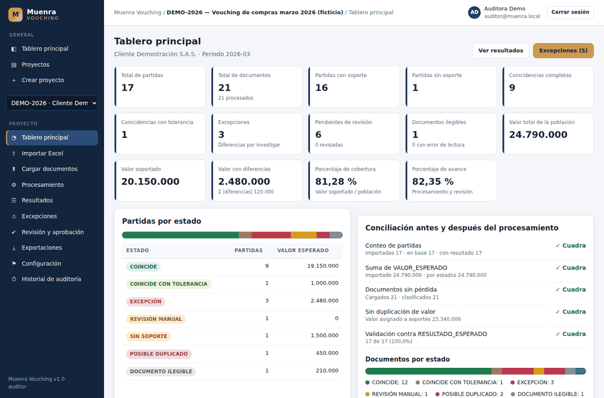
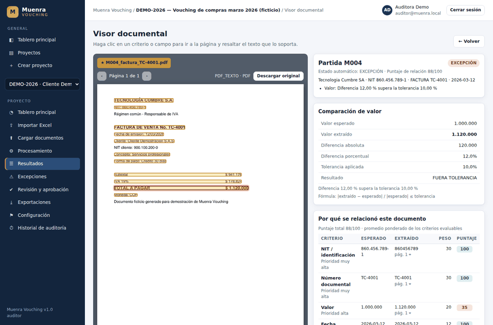
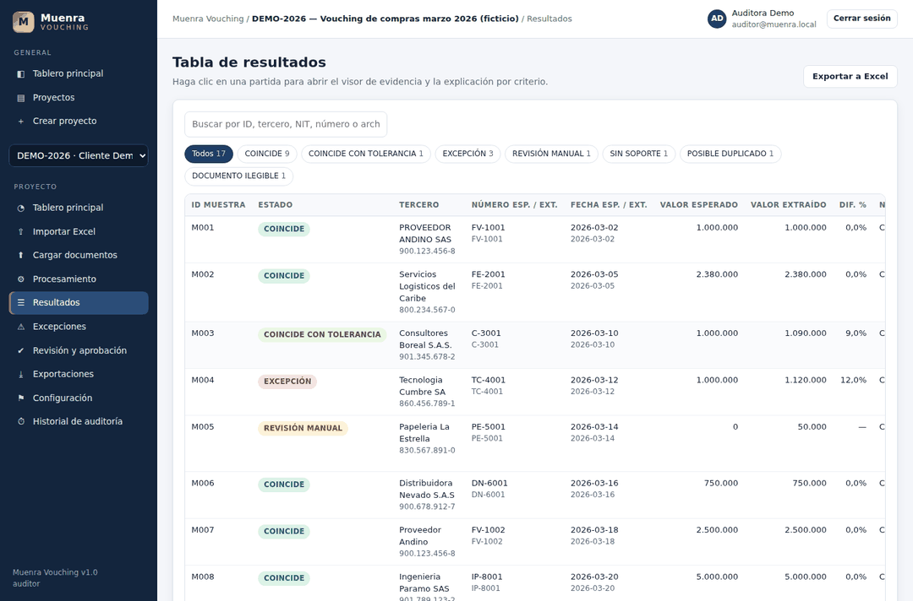
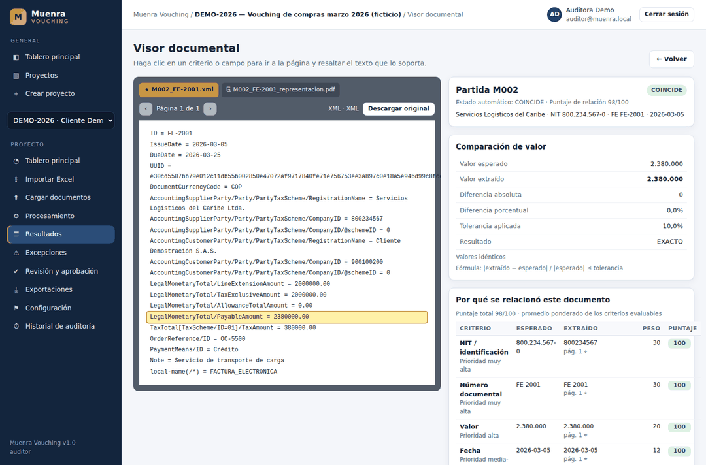
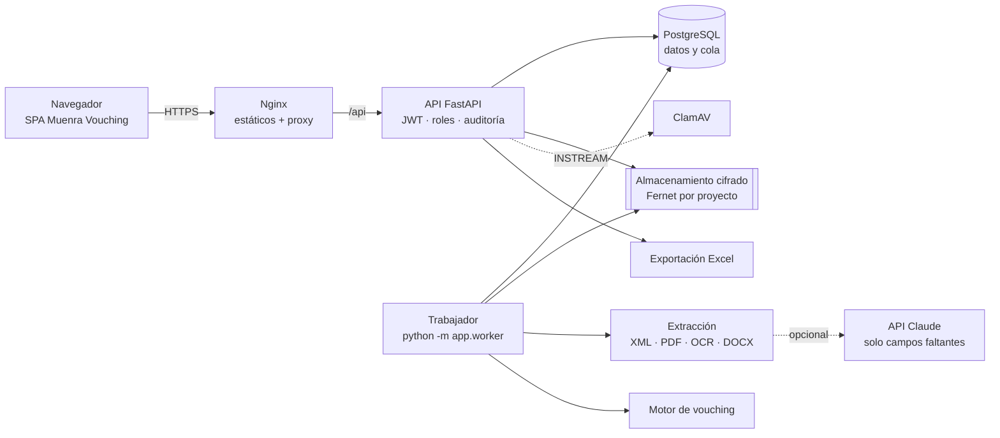

# Muenra Vouching

**Plataforma web de vouching para auditoría financiera.** Relaciona cada partida de una población o muestra contable (Excel) con sus documentos soporte (PDF, XML DIAN, imágenes, DOCX), extrae los campos relevantes con evidencia por campo y página, compara valores, fechas, números, NIT, terceros, contratos y órdenes de compra, explica cada relación criterio por criterio, identifica excepciones para revisión humana y exporta todo a Excel.

> Diseño, código, arquitectura e identidad visual propios. No reutiliza código ni interfaces de herramientas comerciales. Todos los datos de demostración son **ficticios**.

| Tablero | Visor de evidencia |
|---|---|
|  |  |
| **Resultados** | **XML DIAN (extracción determinística)** |
|  |  |

---

## Contenido

1. [Inicio rápido](#inicio-rápido)
2. [Funcionalidades](#funcionalidades)
3. [Arquitectura y tecnologías](#arquitectura-y-tecnologías)
4. [Estructura del repositorio](#estructura-del-repositorio)
5. [Formato del Excel de referencia](#formato-del-excel-de-referencia)
6. [Motor de vouching](#motor-de-vouching)
7. [Seguridad](#seguridad)
8. [Pruebas](#pruebas)
9. [Criterios de aceptación](#criterios-de-aceptación)
10. [Documentación adicional](#documentación-adicional)

---

## Inicio rápido

### Opción A — Docker Compose (recomendada)

```bash
cd muenra-vouching
cp .env.example .env
# Edite .env: POSTGRES_PASSWORD, MUENRA_SECRET_KEY, MUENRA_STORAGE_ENCRYPTION_KEY y MUENRA_BOOTSTRAP_ADMIN_PASSWORD
docker compose up -d --build
# Opcional: datos ficticios de demostración (17 partidas, 21 documentos)
docker compose exec api python -m app.seed --forzar
```

Abra <http://localhost:8080>. Con la demostración cargada: `auditor@muenra.local` / `Demo#Muenra2026` (también `admin@`, `revisor@` y `consulta@`).
Para incluir el antivirus ClamAV: `MUENRA_CLAMAV_HOST=clamav` en `.env` y `docker compose --profile antivirus up -d`.

### Opción B — Local sin Docker (desarrollo)

Requisitos: Python 3.11+, Tesseract OCR con idioma español (`apt install tesseract-ocr tesseract-ocr-spa` / `brew install tesseract tesseract-lang`).

```bash
cd muenra-vouching/backend
python -m venv .venv && source .venv/bin/activate
pip install -r requirements-dev.txt
python -m app.seed                      # crea SQLite local, usuarios y proyecto de demostración
uvicorn app.main:app --reload           # API + interfaz en http://localhost:8000
```

En desarrollo la cola de procesamiento corre como hilo dentro de la API (`MUENRA_INLINE_WORKER=true`) y la base de datos es SQLite. La API documentada está en <http://localhost:8000/api/docs>.

Guía completa: [docs/INSTALACION.md](docs/INSTALACION.md).

---

## Funcionalidades

| Requisito | Implementación |
|---|---|
| Carga de población desde Excel | Hojas `CONFIGURACION`, `REFERENCIA_VOUCHING`, `ENTIDADES_ALIAS`, `TIPOS_DOCUMENTO`, `CAMPOS_EXTRACCION`, `RESULTADO_ESPERADO` (por nombre, sin distinguir mayúsculas). También XLS y CSV. |
| Validación previa | Columnas obligatorias, ID duplicados, partidas repetidas, fechas inválidas, valores vacíos, tipos de dato, DV del NIT, conciliación de registros y de la suma de `VALOR_ESPERADO` contra totales de control → **informe de integridad** (validación en seco antes de importar). |
| Carga masiva | Arrastrar y soltar archivos o carpetas; lotes de 20; validación de tipo real, tamaño, contenido activo y antivirus; SHA-256; cifrado en reposo. |
| Lectura | 1) XML determinístico (UBL 2.1 DIAN, incluido `AttachedDocument`); 2) PDF con texto (coordenadas por palabra); 3) PDF escaneado / PNG / JPG / TIFF con OCR Tesseract; 4) DOCX; 5) IA opcional para completar campos faltantes. |
| Clasificación | 17 tipos documentales (factura de venta/compra/electrónica, RC, CE, contrato, otrosí, OC, certificación, cuenta de cobro, extracto, comprobante contable, notas débito/crédito, documento equivalente, soporte de pago, otro) con motivo explicable; palabras clave ampliables desde el Excel. |
| Campos extraídos | Tipo, número, fechas de emisión y vencimiento, emisor, receptor, NIT y DV, subtotal, base gravable, IVA, retenciones, descuentos, total, moneda, CUFE/CUDE, contrato, OC, centro de coste, concepto, forma de pago, cuenta bancaria, firmantes, vigencia, objeto contractual y tablas. |
| Evidencia por campo | Archivo, SHA-256, página, texto encontrado, región normalizada (x0, y0, x1, y1), método, confianza y fecha de procesamiento. |
| Emparejamiento explicable | Puntaje separado por criterio (NIT, número, valor, fecha, nombre, contrato, OC, concepto, moneda, tipo, archivo), pesos y umbrales configurables. |
| Relaciones | 1:1, una partida con varios soportes (suma), un soporte para varias partidas (sin duplicar valor), soportes complementarios (contrato, OC, egreso…), XML + representación gráfica PDF agrupados. |
| Estados | COINCIDE, COINCIDE CON TOLERANCIA, EXCEPCIÓN, REVISIÓN MANUAL, SIN SOPORTE, SOPORTE NO REFERENCIADO, POSIBLE DUPLICADO, DOCUMENTO ILEGIBLE, ERROR DE LECTURA, PENDIENTE. |
| Revisión humana | Aceptar / rechazar / corregir cada campo (el original se conserva), aprobar / rechazar partidas, cambiar estado con comentario obligatorio, relaciones manuales, comentarios; todo con usuario y fecha. |
| Exportación | Excel con 10 hojas: resumen ejecutivo, resultado completo, coincidencias, excepciones, sin soporte, no referenciados, evidencias, historial de revisiones, parámetros y registro de modelo/OCR/reglas. |
| Pantallas | Inicio de sesión, tablero, crear proyecto, importar Excel, cargar documentos, procesamiento, resultados, visor, excepciones, revisión y aprobación, configuración, usuarios y permisos, historial de auditoría y exportaciones. |

---

## Arquitectura y tecnologías



| Capa | Tecnología seleccionada | Motivo |
|---|---|---|
| Frontend | SPA en JavaScript ES Modules + CSS propio (sin compilación ni CDN) | Cero dependencias externas en el navegador (CSP estricta, apto para redes cerradas de auditoría), fácil de auditar. |
| Backend | Python 3.11 · FastAPI · Pydantic | Ecosistema líder en OCR / PDF / Excel; API documentada automáticamente (OpenAPI). |
| Base de datos | PostgreSQL 16 (producción) · SQLite (desarrollo/pruebas) · SQLAlchemy 2 · Alembic | Relacional, transaccional; migraciones versionadas probadas en ambos motores. |
| Cola | Tabla `jobs` en PostgreSQL con `SELECT … FOR UPDATE SKIP LOCKED`; trabajadores escalables | Sin infraestructura adicional (Redis) y con estado consultable por proyecto. |
| OCR | Tesseract 5 (`spa+eng`) vía pytesseract; renderizado PDF con pypdfium2 | Libre, local (los documentos no salen del servidor), confianza por palabra. |
| PDF / XML / DOCX | pdfplumber · lxml (analizador seguro) · python-docx | Coordenadas por palabra; XML sin entidades externas. |
| Coincidencia difusa | RapidFuzz | Rápido y determinístico. |
| Excel | openpyxl (lectura/escritura) · xlrd (XLS) | Formato nativo de los auditores. |
| Seguridad | bcrypt · JWT (PyJWT) · Fernet (cryptography) · ClamAV | Estándares probados. |
| IA (opcional) | API de Claude (`claude-opus-5-5`) con salida estructurada | Solo completa campos faltantes con cita literal verificada; desactivada por defecto. |
| Contenedores | Docker · Docker Compose · Nginx | Despliegue reproducible. |

Detalle en [docs/ARQUITECTURA.md](docs/ARQUITECTURA.md) y [docs/DECISIONES.md](docs/DECISIONES.md).

---

## Estructura del repositorio

```
muenra-vouching/
├── README.md                     · este documento
├── docker-compose.yml            · db, api, worker, frontend, clamav (perfil)
├── .env.example                  · variables de entorno (sin secretos)
├── backend/
│   ├── Dockerfile · requirements.txt · requirements-dev.txt · alembic.ini · pytest.ini
│   ├── app/
│   │   ├── main.py               · aplicación FastAPI, cabeceras de seguridad, estáticos
│   │   ├── config.py             · configuración por variables de entorno
│   │   ├── database.py · models.py · schemas.py
│   │   ├── security.py           · bcrypt, JWT, roles, permisos, aislamiento por proyecto
│   │   ├── audit.py              · registro de auditoría y enmascaramiento de datos sensibles
│   │   ├── worker.py             · cola de procesamiento asíncrono
│   │   ├── seed.py               · carga del escenario ficticio de demostración
│   │   ├── api/                  · auth, users, projects, documents (importación y carga), results (revisión y exportación)
│   │   └── services/
│   │       ├── normalization.py  · nombres, sufijos jurídicos, NIT/DV, valores, fechas, regla de tolerancia
│   │       ├── matching.py       · motor de vouching explicable + conciliación
│   │       ├── excel_import.py   · lectura de las 6 hojas e informe de integridad
│   │       ├── exporter.py       · exportación Excel (10 hojas)
│   │       ├── dashboard.py · settings_defaults.py · storage.py · file_security.py
│   │       └── extraction/       · xml_extractor, readers (PDF/OCR/imagen/DOCX), fields, classifier, llm, pipeline
│   ├── migrations/               · Alembic (0001 esquema inicial)
│   ├── demo/generate_demo.py     · generador de datos ficticios (Excel + PDF/XML/PNG/TIFF/JPG/DOCX)
│   └── tests/                    · 125 pruebas (unitarias, integración, extremo a extremo)
├── frontend/
│   ├── Dockerfile · nginx.conf · index.html · css/app.css · img/
│   └── js/                       · app.js (enrutador), api.js, ui.js, i18n.js, views/ (14 pantallas)
├── demo/                         · Excel y documentos ficticios generados
└── docs/                         · instalación, manual de usuario, API, arquitectura, modelo de datos, decisiones, restricciones
```

---

## Formato del Excel de referencia

La hoja **REFERENCIA_VOUCHING** es obligatoria. Columnas obligatorias: `ID_MUESTRA`, `TIPO_DOCUMENTO`, `NUMERO_DOCUMENTO`, `FECHA`, `TERCERO`, `NIT`, `VALOR_ESPERADO`. Opcionales: `MONEDA`, `CONTRATO`, `ORDEN_COMPRA`, `CONCEPTO`, `CENTRO_COSTO`, `CUENTA_CONTABLE`, `ARCHIVO_SOPORTE`. Se aceptan alias de encabezado (p. ej. `VALOR`, `OC`, `DESCRIPCION`).

| Hoja | Contenido |
|---|---|
| CONFIGURACION | `PARAMETRO` / `VALOR`: `TOLERANCIA_VALOR` (0,10 o 10 %), `POLITICA_VALOR_CERO`, `UMBRAL_NOMBRE`, `TOLERANCIA_DIAS`, `UMBRAL_RELACION`, `PESO_<criterio>`, `NIT_CLIENTE`, `NOMBRE_CLIENTE`, `PERIODO`, `CONTROL_TOTAL_REGISTROS`, `CONTROL_TOTAL_VALOR`. |
| ENTIDADES_ALIAS | `NIT`, `NOMBRE_CANONICO`, `ALIAS`. |
| TIPOS_DOCUMENTO | `CODIGO`, `NOMBRE`, `PALABRAS_CLAVE` (separadas por `;`), `SOPORTA_VALOR`. |
| CAMPOS_EXTRACCION | `CAMPO`, `DESCRIPCION`, `OBLIGATORIO`, `TIPO_DATO`, `TIPOS_DOCUMENTO`. |
| RESULTADO_ESPERADO | `ID_MUESTRA`, `ESTADO_ESPERADO`, `ARCHIVO`, `OBSERVACION` — el sistema calcula la precisión del motor contra este control. |

Ejemplo completo: [`demo/referencia_vouching_demo.xlsx`](demo/referencia_vouching_demo.xlsx). Especificación: [docs/MANUAL_USUARIO.md](docs/MANUAL_USUARIO.md#4-importar-el-excel-de-referencia).

---

## Motor de vouching

**Regla de valor** (tolerancia predeterminada 10 %, configurable):

```
DIFERENCIA_PORCENTAJE = ABS(VALOR_EXTRAIDO − VALOR_ESPERADO) / ABS(VALOR_ESPERADO)
Coincide si DIFERENCIA_PORCENTAJE ≤ 0,10
```

1.000.000 vs 1.090.000 → 9 % → **COINCIDE CON TOLERANCIA**; 1.000.000 vs 1.120.000 → 12 % → **EXCEPCIÓN**.
Si el valor esperado es cero no se divide: cero contra cero coincide; cualquier otro valor va a **REVISIÓN MANUAL** (o a EXCEPCIÓN con la política `EXACTA`).

**Nombres**: mayúsculas, sin tildes ni puntuación, espacios simples, letras sueltas unidas (`S A S` → `SAS`), sufijos jurídicos retirados solo para comparar (SAS, SA, LTDA, LIMITADA, EU, INC, LLC, COMPANY, COMPAÑÍA…), tabla de alias y similitud difusa con umbral 85 % configurable. **El NIT prevalece**: nunca se aprueba por nombre si el NIT encontrado contradice el esperado.

**NIT**: sin puntos, comas, guiones ni espacios; base y dígito de verificación separados (DV validado con el algoritmo módulo 11 de la DIAN); coincidencia de base y de DV reportadas por separado; texto original conservado.

**Puntaje**: promedio ponderado de los criterios evaluables (pesos por defecto NIT 30, número 30, valor 20, contrato 15, OC 15, fecha 12, nombre 10, archivo 25, tipo 5, concepto 4, moneda 3), penalizado si no hay un identificador fuerte. Cada relación guarda la tabla completa de criterios con valor esperado, valor extraído, puntaje, peso, detalle, página y evidencia.

**Estados**: precedencia POSIBLE DUPLICADO > EXCEPCIÓN > REVISIÓN MANUAL > COINCIDE CON TOLERANCIA > COINCIDE, con motivos explícitos. Una excepción es una diferencia por investigar, **no** una conclusión de fraude.

---

## Seguridad

- Autenticación con contraseñas bcrypt (política de complejidad), JWT de corta duración, bloqueo tras intentos fallidos, recuperación de contraseña con token de un solo uso (SMTP).
- Roles **administrador, auditor, revisor y consulta** con matriz de permisos; aislamiento por proyecto/cliente (un usuario solo ve los proyectos de los que es miembro; los ajenos responden 404).
- Cifrado en tránsito (TLS en Nginx, HSTS en producción) y en reposo (documentos cifrados con Fernet; base de datos sobre volumen cifrado — ver restricciones).
- Validación de archivos: lista blanca de extensiones, firma binaria, límites de tamaño, rechazo de PDF con JavaScript/acciones, Office con macros, XML con entidades, *zip bombs*, firma EICAR y ClamAV.
- Protección contra inyección: ORM parametrizado, XML seguro, nombres de archivo saneados, exportación protegida contra inyección de fórmulas, CSP estricta y construcción del DOM sin `innerHTML`.
- Registro inmutable de accesos y cambios; historial de revisiones; enmascaramiento de NIT, cuentas, correos y secretos en los registros técnicos.
- Secretos solo por variables de entorno; la aplicación no arranca en producción con claves por defecto.
- Política de retención configurable por proyecto (eliminación definitiva de datos y archivos cifrados).
- Los documentos **nunca** se usan para entrenamiento (`allow_training` siempre falso); la IA está desactivada por defecto y requiere autorización por proyecto.

---

## Pruebas

```bash
cd backend
pytest                                   # SQLite
MUENRA_TEST_DATABASE_URL=postgresql+psycopg://usuario@localhost:5432/muenra_test pytest   # PostgreSQL
```

| Archivo | Cobertura |
|---|---|
| `test_normalization.py` | Sufijos jurídicos (SAS ≡ S.A.S. ≡ S A S), alias, similitud, NIT/DV, valores, fechas, números documentales |
| `test_tolerance.py` | Tolerancia 10 % (ejemplos 9 % y 12 %), límite exacto, configurable, valor esperado cero |
| `test_extraction.py` | XML DIAN (Invoice y AttachedDocument), XXE, PDF con coordenadas, **OCR** en PNG y PDF escaneado, DOCX, clasificación de 14 tipos |
| `test_import.py` | Hojas, columnas obligatorias, duplicados, fechas inválidas, vacíos, tipos, totales de control, CSV, validación en seco |
| `test_matching.py` | Duplicados, múltiples soportes, documento compartido sin duplicar valor, NIT contradictorio, XML+PDF, fechas, moneda, OCR baja, ilegibles, revisión persistente, inyección de fórmulas |
| `test_security.py` | Permisos por rol, aislamiento por proyecto, bloqueo, recuperación, archivos maliciosos, cifrado en reposo, enmascaramiento, cabeceras |
| `test_end_to_end.py` | Escenario ficticio completo vía API: 17 partidas y 21 documentos → estados = `RESULTADO_ESPERADO` (100 %), conciliación, revisión humana y exportación |

Resultado actual: **125 pruebas aprobadas** en SQLite y en PostgreSQL 16.

---

## Criterios de aceptación

| # | Criterio | Evidencia |
|---|---|---|
| 1 | Importa correctamente el Excel | `test_import.py`, `test_end_to_end.py` (6 hojas, informe de integridad) |
| 2 | Lee PDF, XML e imágenes | `test_extraction.py` (PDF texto, PDF escaneado, PNG, TIFF, JPG, XML, DOCX) |
| 3 | Aplica OCR cuando es necesario | Páginas con menos de 40 caracteres se procesan con OCR (`readers.read_pdf`) |
| 4 | SAS y S.A.S. equivalentes | `test_legal_suffix_variants_are_equivalent` |
| 5 | Tolerancia predeterminada 10 % | `test_tolerance.py` |
| 6 | Explica por qué relacionó cada soporte | Tabla de criterios por relación (`match_links.criteria`) y visor |
| 7 | Evidencia por campo y página | `extracted_fields` (página, región, texto, método, confianza, fecha) |
| 8 | Identifica excepciones | Panel de excepciones; estados y motivos |
| 9 | Permite revisión humana | Revisión de campos y partidas con historial |
| 10 | Exporta el resultado completo | `test_export_contains_all_sheets_and_columns` |
| 11 | Historial auditable | `audit_logs` y `review_events` (solo inserción) |
| 12 | No pierde ni duplica documentos | Conciliación `conteo_documentos_cuadra`, `sin_duplicacion_de_valor`, SHA-256 |
| 13 | Concilia conteos y valores | Totales de control en la importación y conciliación tras cada ejecución |

---

## Documentación adicional

- [Manual de instalación](docs/INSTALACION.md)
- [Manual de usuario](docs/MANUAL_USUARIO.md)
- [Documentación de la API](docs/API.md) · [OpenAPI](docs/openapi.json) · Swagger en `/api/docs`
- [Arquitectura y diagramas](docs/ARQUITECTURA.md)
- [Modelo de datos](docs/MODELO_DATOS.md)
- [Decisiones técnicas](docs/DECISIONES.md)
- [Restricciones conocidas](docs/RESTRICCIONES.md)
