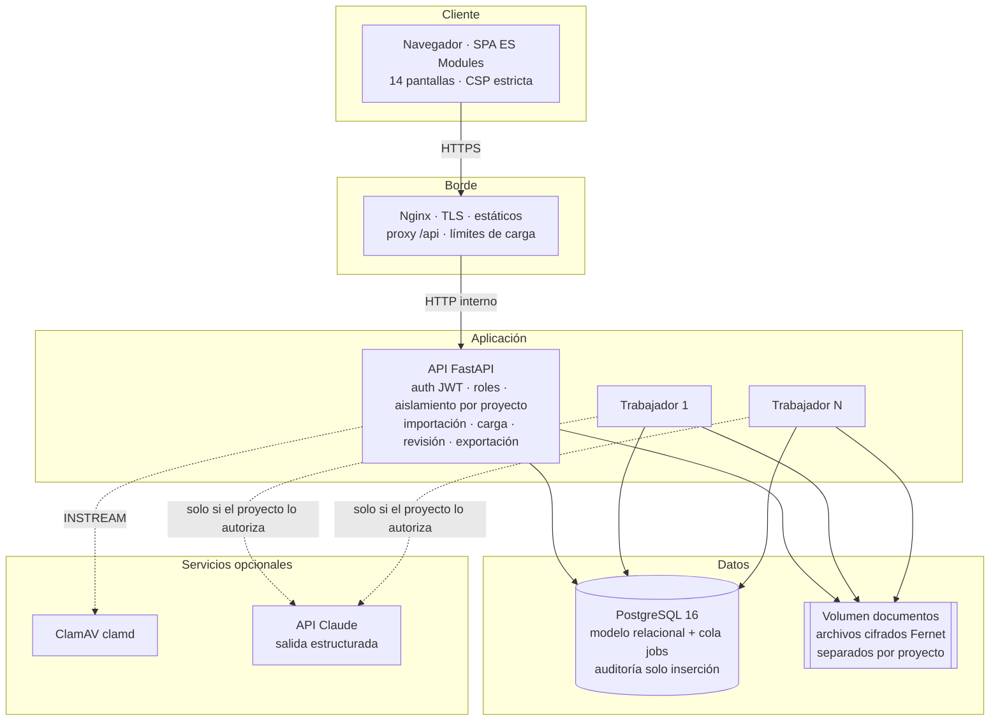
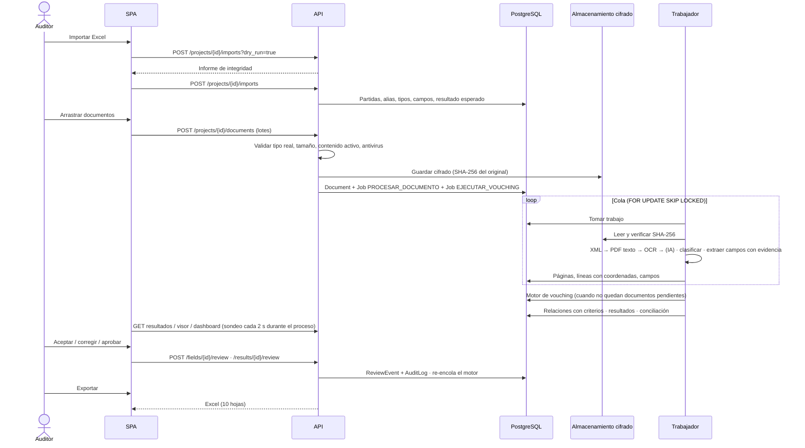

# Arquitectura — Muenra Vouching

## 1. Vista de componentes

## 2. Flujo de procesamiento

## 3. Pipeline de extracción

| Paso | Componente | Evidencia generada |
|---|---|---|
| Validación | `services/file_security.py` | Tipo real, estado antivirus |
| Almacenamiento | `services/storage.py` | SHA-256, ruta cifrada |
| XML | `extraction/xml_extractor.py` | Ruta XPath, valor, confianza 100 |
| PDF con texto | `extraction/readers.read_pdf` | Líneas con región normalizada, tablas |
| PDF escaneado / imagen | `extraction/readers.ocr_image` | Líneas con región y confianza Tesseract por palabra |
| DOCX | `extraction/readers.read_docx` | Párrafos y tablas |
| Campos | `extraction/fields.py` | Etiqueta + valor, página, región, texto, confianza |
| Clasificación | `extraction/classifier.py` | Tipo, confianza, palabras clave que lo justifican |
| IA (opcional) | `extraction/llm.py` | Campo con método `IA` y cita verificada en el texto |

Una página de PDF con menos de `MUENRA_OCR_MIN_TEXT_CHARS` (40) caracteres de texto se considera escaneada y se procesa con OCR a 300 DPI. Un documento sin texto suficiente o con confianza OCR media < 35 queda como **DOCUMENTO ILEGIBLE**; un fallo técnico como **ERROR DE LECTURA** (con reintentos hasta 3 veces).

## 4. Motor de vouching (`services/matching.py`)

1. **Vistas de documento** con las correcciones humanas aplicadas (el valor original nunca se modifica).
2. **Unidades documentales**: agrupa XML + PDF de la misma factura (mismo CUFE o mismo NIT + número). Duplicados: mismo SHA-256, o dos archivos del mismo formato con el mismo número/emisor/CUFE.
3. **Puntuación por pares** partida × unidad con bloqueo (solo pares con alguna señal común) y un puntaje por criterio.
4. **Asignación**: (a) relaciones manuales; (b) 1:1 voraz por puntaje; (c) documento compartido por varias partidas si la suma de las partidas cabe en el valor del documento; (d) combinación de varios soportes cuya suma alcanza el valor; (e) soportes complementarios (contrato, OC, egreso, recibo, certificación) que referencian la partida.
5. **Asignación de valor** sin duplicar: lo asignado a un documento nunca supera su valor.
6. **Estado y motivos** por partida; estado de cada documento (incluye SOPORTE NO REFERENCIADO).
7. **Conciliación**: conteos y valores importados vs. en base vs. por estado; documentos cargados vs. clasificados; valor asignado sin sobreasignación; precisión contra `RESULTADO_ESPERADO`.

Las decisiones del revisor (`manual_status`, `review_decision`) y las relaciones manuales se conservan entre ejecuciones.

## 5. Seguridad por capas

| Capa | Control |
|---|---|
| Transporte | TLS en Nginx, HSTS, CORS restringido |
| Navegador | CSP `script-src 'self'`, sin `innerHTML` con datos, token en `sessionStorage` |
| API | JWT HS256 con emisor y expiración, bcrypt, bloqueo por intentos, permisos por rol, aislamiento por proyecto (404 para ajenos) |
| Archivos | Lista blanca, firma binaria, tamaño, contenido activo, macros, XXE, zip bomb, EICAR, ClamAV |
| Datos | Cifrado Fernet por archivo, verificación SHA-256 al leer, separación de carpetas por proyecto |
| Trazabilidad | `audit_logs` y `review_events` solo inserción; enmascaramiento en registros técnicos |
| Ciclo de vida | Retención por proyecto y eliminación definitiva; entrenamiento con documentos bloqueado |

## 6. Despliegue

`docker-compose.yml` define `db` (PostgreSQL 16), `api` (migración + Uvicorn, 2 procesos), `worker` (escalable), `frontend` (Nginx) y `clamav` (perfil opcional) en una red interna; solo Nginx publica puerto.
