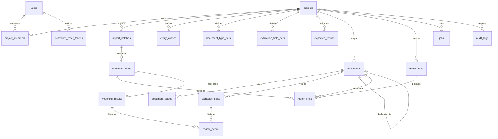

# Modelo de datos — Muenra Vouching

Migración inicial: `backend/migrations/versions/0001_esquema_inicial.py`. Todas las tablas de negocio cuelgan de `projects` (aislamiento por cliente/encargo) con borrado en cascada.

| Tabla | Propósito | Campos clave |
|---|---|---|
| `users` | Usuarios | `email`, `password_hash` (bcrypt), `role`, `is_active`, `failed_attempts`, `locked_until` |
| `password_reset_tokens` | Recuperación | `token_hash` (SHA-256 del token), `expires_at`, `used_at` |
| `projects` | Proyecto / cliente | `code`, `client_nit`, `settings` (JSON de parámetros), `allow_ai_processing`, `allow_training` (siempre falso), `retention_days` |
| `project_members` | Acceso por proyecto | `project_id`, `user_id` |
| `import_batches` | Cargas del Excel | `sha256`, `status`, `row_count`, `total_value`, `integrity_report` (JSON) |
| `reference_items` | Partidas | `sample_id`, `doc_type`, `doc_number`, `doc_date`, `third_party`, `nit`, `expected_value`, `currency`, `contract`, `purchase_order`, `concept`, `expected_file` |
| `entity_aliases` | Alias de terceros | `nit`, `canonical_name`, `alias` |
| `document_type_defs` | Palabras clave por tipo | `code`, `keywords` |
| `extraction_field_defs` | Campos solicitados | `field`, `required`, `data_type` |
| `expected_results` | Control de calidad del motor | `sample_id`, `expected_status` |
| `documents` | Soportes | `filename`, `sha256`, `stored_path` (cifrado), `file_type`, `av_status`, `processing_status`, `doc_type`, `extraction_method`, `ocr_confidence`, `full_text`, `tables`, `duplicate_of_id`, `group_key`, `vouching_status` |
| `document_pages` | Páginas | `page_number`, `method`, `ocr_confidence`, `lines` (texto + región + confianza) |
| `extracted_fields` | Campo con evidencia | `field_name`, `value` (original, inmutable), `normalized_value`, `page`, `bbox`, `evidence_text`, `method`, `confidence`, `extracted_at`, `review_status`, `corrected_value`, `reviewed_by`, `reviewed_at`, `review_comment` |
| `match_runs` | Ejecuciones del motor | `parameters` (JSON), `reconciliation` (JSON), `engine_version` |
| `match_links` | Relación partida ↔ documento | `role` (PRINCIPAL, REPRESENTACION_GRAFICA, COMPLEMENTARIO), `score`, `criteria` (JSON por criterio), `allocated_value`, `is_manual` |
| `vouching_results` | Resultado por partida | `auto_status`, `reasons`, valores extraídos, diferencias, similitud, coincidencia NIT/DV/número, días, confianza OCR, evidencia, `explanation` (JSON), `manual_status`, `review_decision`, revisor y fecha |
| `review_events` | Historial de revisiones (solo inserción) | `action`, `field_name`, `old_value`, `new_value`, `comment`, `user_email`, `created_at` |
| `audit_logs` | Accesos y cambios (solo inserción) | `action`, `entity`, `entity_id`, `detail` (JSON), `ip`, `success` |
| `jobs` | Cola | `kind`, `payload`, `status` (EN_COLA, EN_PROCESO, COMPLETADO, FALLIDO), `attempts`, `error` |

Valores monetarios: `NUMERIC(20,2)`. Fechas con zona horaria (UTC).
